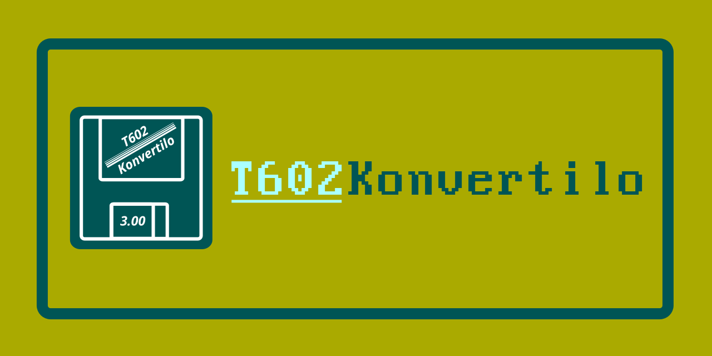

- [en] A multiplatform tool for converting Text602 documents
- **[cs] Multiplatformní nástroj pro konverzi dokumentů Text602**
- [sk] Multiplatformový nástroj na konverziu dokumentov Text602
- [eo] Platformneŭtrala ilo por konverti dokumentojn de Text602

## Popis projektu

T602Konvertilo je multiplatformní nástroj sloužící k převodu dokumentů
z obsolentního proprietárního formátu editoru **Text602 (verze 3.00 z roku
1992)** do formátu JSON AST *(Abstract Syntax Tree)* pro univerzální
konverzní nástroj [Pandoc](https://pandoc.org).

Nahrazuje tedy práci modulu reader (čtečky) v Pandocu, jenž dokumenty
T602 nativně nepodporuje, a parsuje dokument &bdquo;Text.602&ldquo; přímo do
jeho interního formátu AST.  
Výstupní soubor (ast).json posléze slouží jednoduše jako vstup ke konverzi
do prakticky libovolného formátu.  
Např.:  
`pandoc --from json --to html < vstup-ast.json > vystup.html`

### Workflow použití nástroje:

```text
 originální formát   ⟶ Text602 dokument
     (doc.602)
         ↓
+-----------------+
|     (reader)    |  ⟶ T602Konvertilo
+-----------------+
         ↓
     mezistupeň
   (doc-ast.json)    ⟶ Pandoc AST jako JSON
         ↓
+-----------------+
|       AST       |
|        ↓        |
|     (filter)    |
|        ↓        |  ⟶ interní workflow Pandoc
|       AST       |    (rámcově)
|        ↓        |
|     (writer)    |
+-----------------+
         ↓
   cílový formát     ⟶ libovolný formát podporovaný nástrojem Pandoc
      (doc.*)
```

### Výčet funkcí

- převod (export) dokumentu Text602 *(výstup v UTF-8)*:
  - `*.602` ⟶ `(pandoc-ast).json`
  - `*.602` ⟶ `*.txt`
- změna kódování původního dokumentu Text602:
  - KEYBCS2
  - LATIN2 (CP852)
  - KOI8ČS
- zobrazení metadat dokumentu Text602

## Zdrojové kódy

Více informací najdete na [GitHubu](https://github.com/ma-ta/t602konvertilo).

## Autor

Copyright (c) 2025&nbsp;&nbsp;Martin TÁBOR

## Licence

Freeware & Open source  
GNU General Public License v3.0 or later (SPDX: GPL-3.0-or-later)  
https://spdx.org/licenses/GPL-3.0-or-later.html
