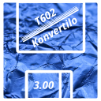

```text
  _____ __    ___ ____  _  __                         _   _ _
|_   _/ /_  / _ \___ \| |/ /___  _ ____   _____ _ __| |_(_) | ___
  | || '_ \| | | |__) | ' // _ \| '_ \ \ / / _ \ '__| __| | |/ _ \
  | || (_) | |_| / __/| . \ (_) | | | \ V /  __/ |  | |_| | | (_) |
  |_| \___/ \___/_____|_|\_\___/|_| |_|\_/ \___|_|   \__|_|_|\___/
```

- **[cs] Multiplatformní nástroj pro konverzi dokumentů Text602**
- [sk] Multiplatformový nástroj na konverziu dokumentov Text602
- [en] A multiplatform tool for converting Text602 documents
- [eo] Platformneŭtrala ilo por konverti dokumentojn de Text602

## Popis projektu
T602Konvertilo je multiplatformní aplikace sloužící k převodu dokumentů
z obsolentního proprietárního formátu editoru Text602 (verze 3.00 z roku
1992) do formátu JSON AST *(Abstract Syntax Tree)* pro univerzální
konverzní nástroj Pandoc.

Nahrazuje tedy práci modulu reader (čtečky) v Pandocu, který T602 nativně
nepodporuje, a parsuje Text602 dokument do interního formátu Pandoc.
Výstupní soubor ast.json posléze může být použit přímo jako vstup Pandocu.
Např.:  
`pandoc --from json --to html < vstup-ast.json > vystup.html`

### Workflow použití nástroje:
```text
 originální formát   ⟶ Text602 dokument
     (doc.602)
         ↓
+-----------------+
|     (reader)    |  ⟶ T602Konvertilo
+-----------------+
         ↓
     mezistupeň
   (doc-ast.json)    ⟶ Pandoc AST jako JSON
         ↓
+-----------------+
|       AST       |
|        ↓        |
|     (filter)    |
|        ↓        |  ⟶ interní workflow Pandoc
|       AST       |    (rámcově)
|        ↓        |
|     (writer)    |
+-----------------+
         ↓
   cílový formát     ⟶ libovolný formát podporovaný nástrojem Pandoc
      (doc.*)
```

## Zdrojové kódy
Více informací najdete na [GitHubu](https://github.com/ma-ta/t602konvertilo).

## Autor
Copyright (c) 2025&nbsp;&nbsp;Martin TÁBOR

  ## Licence
  Freeware & Open source  
  GNU General Public License v3.0 or later (SPDX: GPL-3.0-or-later)  
  https://spdx.org/licenses/GPL-3.0-or-later.html
